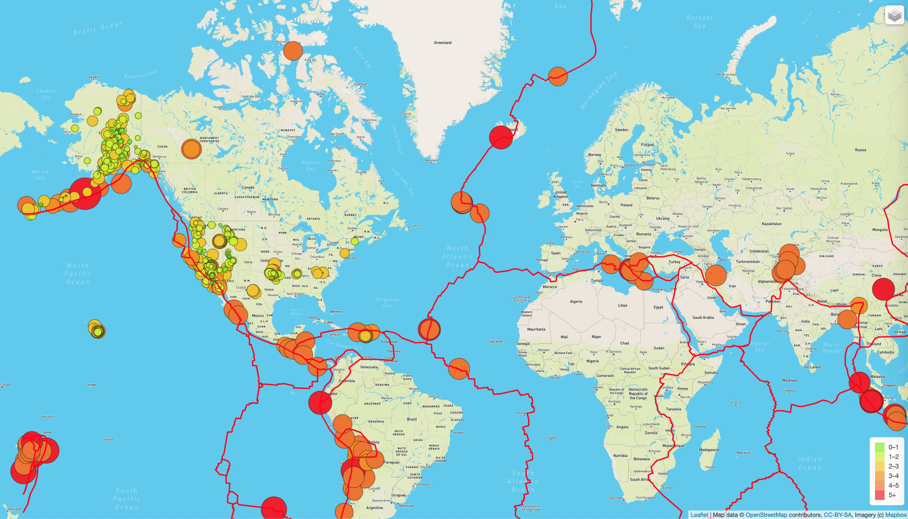
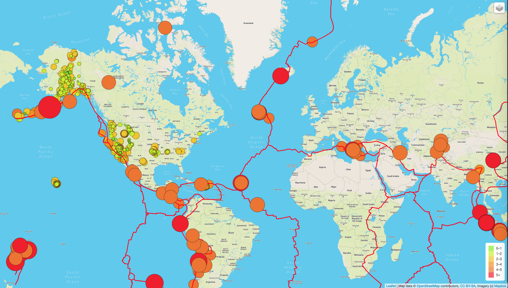
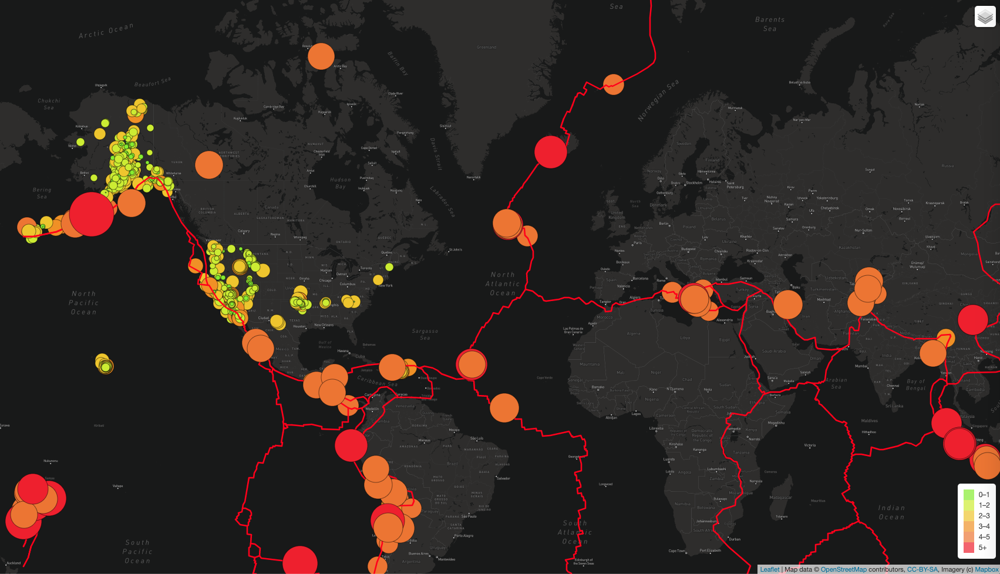

# Earthquake Challenge

## Project Overview

The purpose of this project is to utilize the power of JavaScript, Leaflet.js and geoJSON data and add major earthquake data to the map using d3.json(). The intensity of magnitude is represented with colors and radius of circle based on magnitude of earthquake. There are three tasks for this project:

### Task 1: 
- Using d3.json() callback method an API call is made to the following URL:
https://raw.githubusercontent.com/fraxen/tectonicplates/blob/master/GeoJSON/PB2002_boundaries.json

- The Tectonic Plate data is added to the geoJSON() layer
- Finally the tectonicPlates layer group variable is added to the map.

After adding tectonic plates overlay, the map looks like the following:

### Task 2:
- In this task, major earthquake data with magnitude 4.5+ is added as a third layer group by calling the following URL is d3.json():
https://earthquake.usgs.gov/earthquakes/feed/v1.0/summary/4.5_week.geojson

After adding major earthquakes overlay, the map looks like the following:

### Task 3:
- Finally a third layer "Dark" mode is added as a third map tile layer.

After adding dark mode to the tile layer, the map looks like the following:
